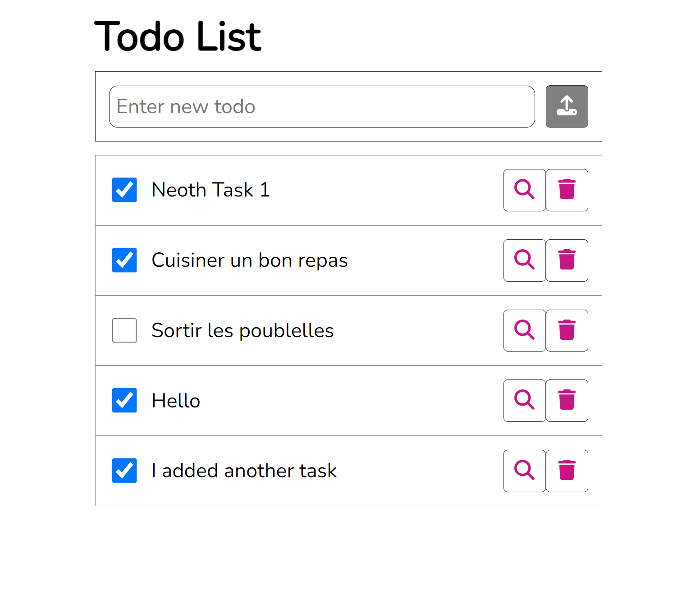

# A simple and efficient task management application built with React and RTK query (redux)

## Key Features

-   Create, edit, and delete tasks: Easily manage your to-do list. (WIP)
-   Mark tasks as completed: Track your progress. (WIP)
-   Intuitive user interface: A clean and modern design for a pleasant user experience.
-   Built with modern technologies: Leveraging React, Redux, and Vite for a performant and scalable application.

## Technologies Used

-   Front-end: React, Redux, Vite
-   State Management: Redux Toolkit
-   UI Components: FontAwesome
-   API Consumption: Custom REST API created with Express js and deployed on render
